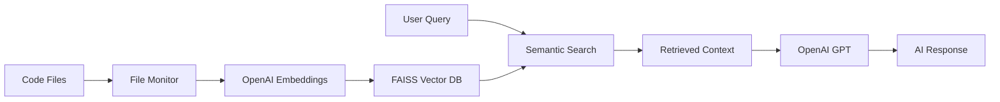

# 🤖 CodeRAG: AI-Powered Code Retrieval & Assistance

[](https://www.python.org/downloads/)
[](https://opensource.org/licenses/Apache-2.0)
[](https://github.com/Neverdecel/CodeRAG/actions/workflows/ci-tests.yml)

> **Note**: This POC was innovative for its time, but modern tools like Cursor and Windsurf now apply this principle directly in IDEs. This remains an excellent educational project for understanding RAG implementation.

## ✨ What is CodeRAG?

CodeRAG combines **Retrieval-Augmented Generation (RAG)** with AI to provide intelligent coding assistance. Instead of limited context windows, it indexes your entire codebase and provides contextual suggestions based on your complete project.

### 🎯 Core Idea

Most coding assistants work with limited scope, but CodeRAG provides the full context of your project by:
- **Real-time indexing** of your entire codebase using FAISS vector search
- **Semantic code search** powered by OpenAI embeddings
- **Contextual AI responses** that understand your project structure

## 🚀 Quick Start

### Prerequisites
- Python 3.11+
- OpenAI API Key ([Get one here](https://platform.openai.com/api-keys))

### Installation

```bash
# Clone the repository
git clone https://github.com/your-username/CodeRAG.git
cd CodeRAG

# Create virtual environment
python -m venv venv
source venv/bin/activate  # On Windows: venv\\Scripts\\activate

# Install dependencies (installs the package with dev extras)
pip install -r requirements.txt

# Configure environment
cp example.env .env
# Edit .env with your OpenAI API key and settings
```

> The requirements file simply references `-e .[dev]`; feel free to run
> `pip install -e .[dev]` directly if you prefer editable installs.

### Configuration

Create a `.env` file with your settings:

```env
OPENAI_API_KEY=your_openai_api_key_here
OPENAI_EMBEDDING_MODEL=text-embedding-ada-002
OPENAI_CHAT_MODEL=gpt-4
WATCHED_DIR=/path/to/your/code/directory
FAISS_INDEX_FILE=./coderag_index.faiss
EMBEDDING_DIM=1536
```

### Running CodeRAG

```bash
# Start the backend (indexing and monitoring)
python main.py

# In a separate terminal, start the web interface
streamlit run app.py

# Query the local index from the terminal (after indexing completes)
coderag-cli "how is faiss configured?"
```

## 📖 How It Works



1. **Indexing**: CodeRAG monitors your code directory and generates embeddings for Python files
2. **Storage**: Embeddings are stored in a FAISS vector database with metadata
3. **Search**: User queries are embedded and matched against the code database
4. **Generation**: Retrieved code context is sent to GPT models for intelligent responses

## 🛠️ Architecture

```
CodeRAG/
├── 🧠 coderag/           # Core RAG functionality
│   ├── config.py         # Environment configuration
│   ├── embeddings.py     # OpenAI embedding generation
│   ├── index.py          # FAISS vector operations
│   ├── search.py         # Semantic code search
│   └── monitor.py        # File system monitoring
├── 🌐 app.py            # Streamlit web interface
├── 🔧 main.py           # Backend indexing service
├── 🔗 prompt_flow.py    # RAG pipeline orchestration
└── 📋 requirements.txt   # Dependencies
```

### Key Components

- **🔍 Vector Search**: FAISS-powered similarity search for code retrieval
- **🎯 Smart Embeddings**: OpenAI embeddings capture semantic code meaning
- **📡 Real-time Updates**: Watchdog monitors file changes for live indexing
- **💬 Conversational UI**: Streamlit interface with chat-like experience

## 🎪 Usage Examples

### Ask About Your Code
```
"How does the FAISS indexing work in this codebase?"
"Where is error handling implemented?"
"Show me examples of the embedding generation process"
```

### Get Improvements
```
"How can I optimize the search performance?"
"What are potential security issues in this code?"
"Suggest better error handling for the monitor module"
```

### Debug Issues
```
"Why might the search return no results?"
"How do I troubleshoot OpenAI connection issues?"
"What could cause indexing to fail?"
```

## ⚙️ Development

### Code Quality Tools

```bash
# Install pre-commit hooks
pip install pre-commit
pre-commit install
pre-commit run --all-files
```

### Testing

```bash
# Test FAISS index functionality
python tests/test_faiss.py

# Test individual components
python scripts/initialize_index.py
python scripts/run_monitor.py
```

## 🐛 Troubleshooting

### Common Issues

**Search returns no results**
- Check if indexing completed: look for `coderag_index.faiss` file
- Verify OpenAI API key is working
- Ensure your query relates to indexed Python files

**OpenAI API errors**
- Verify API key in `.env` file
- Check API usage limits and billing
- Ensure model names are correct (gpt-4, text-embedding-ada-002)

**File monitoring not working**
- Check `WATCHED_DIR` path in `.env`
- Ensure directory contains `.py` files
- Look for error logs in console output

## 🤝 Contributing

1. Fork the repository
2. Create a feature branch (`git checkout -b feature/amazing-feature`)
3. Make your changes with proper error handling and type hints
4. Run code quality checks (`pre-commit run --all-files`)
5. Commit your changes (`git commit -m 'Add amazing feature'`)
6. Push to the branch (`git push origin feature/amazing-feature`)
7. Open a Pull Request

## 📄 License

This project is licensed under the Apache License 2.0 - see the [LICENSE](LICENSE-2.0.txt) file for details.

## 🙏 Acknowledgments

- [OpenAI](https://openai.com/) for embedding and chat models
- [Facebook AI Similarity Search (FAISS)](https://github.com/facebookresearch/faiss) for vector search
- [Streamlit](https://streamlit.io/) for the web interface
- [Watchdog](https://github.com/gorakhargosh/watchdog) for file monitoring

---

**⭐ If this project helps you, please give it a star!**
