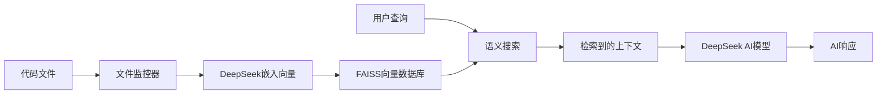

# 🤖 CodeRAG: AI驱动的代码检索与助手

[](https://www.python.org/downloads/)
[](https://opensource.org/licenses/Apache-2.0)
[](https://github.com/Neverdecel/CodeRAG/actions/workflows/ci-tests.yml)

> **注意**: 这个概念验证项目在当时很有创新性，但现代工具如 Cursor 和 Windsurf 已经直接在IDE中应用了这一原理。这仍然是一个优秀的RAG实现教育项目。

## ✨ CodeRAG 是什么？

CodeRAG 将**检索增强生成(RAG)**与AI相结合，提供智能编码辅助。不同于有限上下文窗口的传统助手，它可以索引您的整个代码库，并根据完整的项目提供上下文建议。

### 🎯 核心思想

大多数编码助手只能在有限范围内工作，而CodeRAG通过以下方式提供项目的完整上下文：
- **实时索引**：使用FAISS向量搜索对整个代码库进行索引
- **语义代码搜索**：基于DeepSeek嵌入向量的智能搜索
- **上下文AI响应**：理解项目结构的智能回答

## 🚀 快速开始

### 前置要求
- Python 3.11+
- DeepSeek API密钥 ([获取地址](https://platform.deepseek.com/api_keys))

### 安装

```bash
# 克隆仓库
git clone https://github.com/your-username/CodeRAG.git
cd CodeRAG

# 创建虚拟环境
python -m venv venv
# Windows: venv\Scripts\activate
# Linux/Mac: source venv/bin/activate

# 安装依赖（包含开发环境）
pip install -r requirements.txt

# 配置环境
cp example.env .env
# 编辑.env文件，填入您的API密钥和设置
```

> requirements.txt文件仅包含`-e .[dev]`引用；如果您喜欢可编辑安装，可以直接运行`pip install -e .[dev]`

### 配置

创建`.env`文件并配置以下设置：

```env
# DeepSeek配置
DEEPSEEK_API_KEY=your_deepseek_api_key_here
DEEPSEEK_EMBEDDING_MODEL=text-embedding-v3
DEEPSEEK_CHAT_MODEL=deepseek-chat
DEEPSEEK_API_BASE=https://api.deepseek.com

# 项目配置
WATCHED_DIR=/path/to/your/code/directory
FAISS_INDEX_FILE=./index/faiss_index.bin
EMBEDDING_DIM=768
```

### 运行CodeRAG

```bash
# 启动后端服务（索引和监控）
python main.py

# 在另一个终端中，启动Web界面
streamlit run app.py

# 从终端查询本地索引（索引完成后）
# 注意：当前版本暂不支持CLI命令，请使用Web界面
```

## 📖 工作原理



1. **索引**：CodeRAG监控您的代码目录并为Python文件生成嵌入向量
2. **存储**：嵌入向量和元数据存储在FAISS向量数据库中
3. **搜索**：用户查询被嵌入并与代码数据库进行匹配
4. **生成**：检索到的代码上下文被发送到AI模型进行智能响应

## 🛠️ 系统架构

```
CodeRAG/
├── 🧠 coderag/           # 核心RAG功能
│   ├── config.py         # 环境配置管理
│   ├── embeddings.py     # 嵌入向量生成
│   ├── index.py          # FAISS向量操作
│   ├── search.py         # 语义代码搜索
│   └── monitor.py        # 文件系统监控
├── 🌐 app.py            # Streamlit Web界面
├── 🔧 main.py           # 后端索引服务
├── 🔗 prompt_flow.py    # RAG流程编排
└── 📋 requirements.txt   # 依赖管理
```

### 核心组件

- **🔍 向量搜索**：基于FAISS的相似性搜索，用于代码检索
- **🎯 智能嵌入**：DeepSeek嵌入向量捕捉代码的语义含义
- **📡 实时更新**：Watchdog监控文件变化，实现实时索引
- **💬 对话式UI**：Streamlit界面提供类似聊天的用户体验

## 🎪 使用示例

### 询问代码相关问题
```
"这个代码库中的FAISS索引是如何工作的？"
"错误处理在哪里实现？"
"给我展示嵌入向量生成过程的示例"
```

### 获取改进建议
```
"如何优化搜索性能？"
"这段代码有哪些潜在的安全问题？"
"为监控模块建议更好的错误处理方式"
```

### 调试问题
```
"为什么搜索没有返回结果？"
"如何排查DeepSeek连接问题？"
"什么原因可能导致索引失败？"
```

## ⚙️ 开发指南

### 代码质量工具

```bash
# 安装pre-commit钩子
pip install pre-commit
pre-commit install
pre-commit run --all-files
```

### 测试

```bash
# 测试FAISS索引功能
python tests/test_faiss.py

# 测试各个组件
python scripts/initialize_index.py
python scripts/run_monitor.py
```

## 🐛 故障排除

### 常见问题

**搜索没有返回结果**
- 检查索引是否完成：查看`index/faiss_index.bin`文件
- 验证DeepSeek API密钥是否有效
- 确保查询与已索引的Python文件相关

**DeepSeek API错误**
- 验证`.env`文件中的API密钥
- 检查API使用限制和账单状态
- 确保模型名称正确（deepseek-chat, text-embedding-v3）

**文件监控不工作**
- 检查`.env`中的`WATCHED_DIR`路径
- 确保目录包含`.py`文件
- 查看控制台输出中的错误日志

## 🤝 贡献指南

1. Fork 项目仓库
2. 创建功能分支 (`git checkout -b feature/amazing-feature`)
3. 进行代码更改，包含适当的错误处理和类型提示
4. 运行代码质量检查 (`pre-commit run --all-files`)
5. 提交更改 (`git commit -m '添加新功能'`)
6. 推送到分支 (`git push origin feature/amazing-feature`)
7. 创建Pull Request

## 📄 许可证

本项目基于Apache License 2.0许可证 - 详情请查看 [LICENSE](LICENSE-2.0.txt) 文件。

## 🙏 致谢

- [DeepSeek](https://www.deepseek.com/) - 提供嵌入向量和聊天模型
- [Facebook AI Similarity Search (FAISS)](https://github.com/facebookresearch/faiss) - 向量搜索库
- [Streamlit](https://streamlit.io/) - Web界面框架
- [Watchdog](https://github.com/gorakhargosh/watchdog) - 文件监控功能

---

**⭐ 如果这个项目对您有帮助，请给它一个星标！**